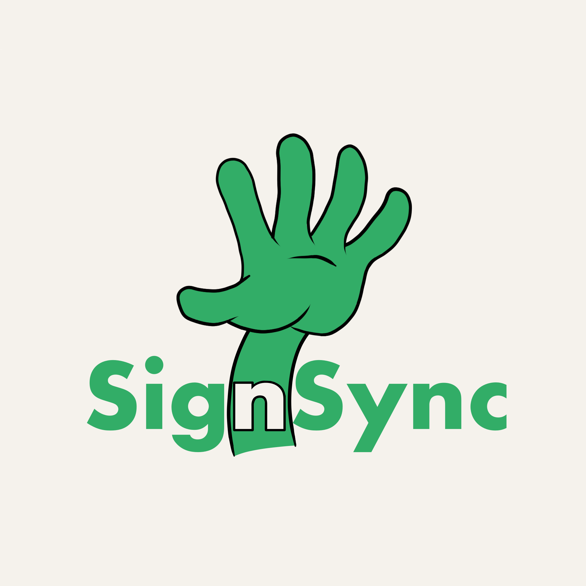

# SignSync



## Running this extension

1. Clone this repository
2. Load this directory in Chrome as an [unpacked extension](https://developer.chrome.com/docs/extensions/mv3/getstarted/development-basics/#load-unpacked)
3. Pin the extension from the extension menu
4. Navigate to the webpage you want to record
5. Click the extension icon to open the control panel
6. Click the start recording button to begin recording
7. Click the stop recording button to end recording and download the file


## Running Backend
1. Follow the following commands
```
cd SignSync-Backend
cd speech-backend
npm install
docker-compose up --build
```
2. Open the browser and test the extension
3. For error will be reflected in the console


## Running Unity
1. Follow the following commands
```
cd unity
docker-compose up --build
```
2. Open the browser and test the extension
3. For error will be reflected in the console